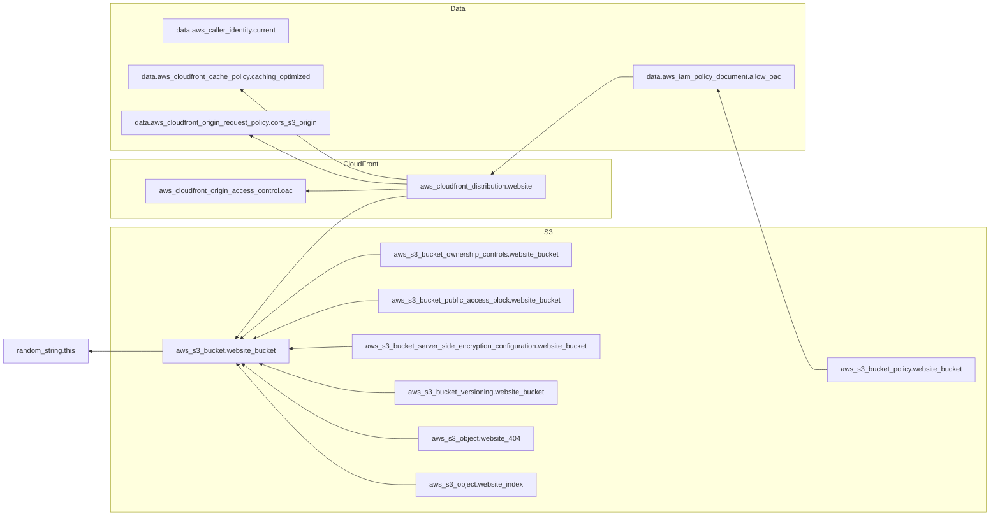

# Project Overview.

<p align="left">
  This is a simple static website that will display <b>This is Lano Puljic's Website.</b>
  <br />
</p>

<div align="center">
  <blockquote>
    Building this hosted Static website was guided by 3 virtues of a programmer:<br>
    1. Laziness (effort to reduce energy expenditure).<br>
    2. Impatience (making things anticipate needs).<br>
    3. Hubris (building programs others won't criticize).
  </blockquote>
</div>

<p align="center">
  <a href="docs/solution_overview.md">Overview</a>
  ·
  <a href="docs/alternative_solution.md">Alternative_Solution</a>
  ·
  <a href="docs/requirement_for_production.md">Production_Readiness</a>
  ·
  <a href="docs/what_else_i_would_do.md">What_Else</a>
  ·
</p>

## Mermaid Diagram

<details><summary>Diagram</summary>



</details>

## Prerequisites

- [Terraform](https://www.terraform.io/downloads.html) >= 1.0
- AWS CLI configured with appropriate credentials and permissions
- AWS IAM User with required permissions to deploy S3 and CloudFront

## Usage

1. Before you start you will need to export AWS Credentials.
   ```bash
   export AWS_ACCESS_KEY_ID=""
   export AWS_SECRET_ACCESS_KEY=""
   ```

2. Navigate to the infrastructure directory:
   ```bash
   cd terraform/infra/
   ```

3. Initialize Terraform:
    ```bash
    terraform init
    ```

4. (Optional) Review the planned changes:
    ```bash
    terraform plan
    ```

5. Apply the infrastructure:
    ```bash
    terraform apply
    Confirm the apply by typing `yes` when prompted.
    ```

## Cleanup
To destroy the infrastructure:
```bash
terraform destroy
```
Confirm by typing `yes` when prompted.


## Requirements

| Name | Version |
|------|---------|
| <a name="requirement_terraform"></a> [terraform](#requirement\_terraform) | >= 1.0 |
| <a name="requirement_aws"></a> [aws](#requirement\_aws) | >= 6.0 |
| <a name="requirement_random"></a> [random](#requirement\_random) | >= 2.0 |

## Providers

| Name | Version |
|------|---------|
| <a name="provider_aws"></a> [aws](#provider\_aws) | >= 6.0 |
| <a name="provider_random"></a> [random](#provider\_random) | >= 2.0 |

## Modules

No modules.

## Resources

| Name | Type |
|------|------|
| [aws_cloudfront_distribution.website](https://registry.terraform.io/providers/hashicorp/aws/latest/docs/resources/cloudfront_distribution) | resource |
| [aws_cloudfront_origin_access_control.oac](https://registry.terraform.io/providers/hashicorp/aws/latest/docs/resources/cloudfront_origin_access_control) | resource |
| [aws_s3_bucket.website_bucket](https://registry.terraform.io/providers/hashicorp/aws/latest/docs/resources/s3_bucket) | resource |
| [aws_s3_bucket_ownership_controls.website_bucket](https://registry.terraform.io/providers/hashicorp/aws/latest/docs/resources/s3_bucket_ownership_controls) | resource |
| [aws_s3_bucket_policy.website_bucket](https://registry.terraform.io/providers/hashicorp/aws/latest/docs/resources/s3_bucket_policy) | resource |
| [aws_s3_bucket_public_access_block.website_bucket](https://registry.terraform.io/providers/hashicorp/aws/latest/docs/resources/s3_bucket_public_access_block) | resource |
| [aws_s3_bucket_server_side_encryption_configuration.website_bucket](https://registry.terraform.io/providers/hashicorp/aws/latest/docs/resources/s3_bucket_server_side_encryption_configuration) | resource |
| [aws_s3_bucket_versioning.website_bucket](https://registry.terraform.io/providers/hashicorp/aws/latest/docs/resources/s3_bucket_versioning) | resource |
| [aws_s3_object.website_404](https://registry.terraform.io/providers/hashicorp/aws/latest/docs/resources/s3_object) | resource |
| [aws_s3_object.website_index](https://registry.terraform.io/providers/hashicorp/aws/latest/docs/resources/s3_object) | resource |
| [random_string.this](https://registry.terraform.io/providers/hashicorp/random/latest/docs/resources/string) | resource |
| [aws_caller_identity.current](https://registry.terraform.io/providers/hashicorp/aws/latest/docs/data-sources/caller_identity) | data source |
| [aws_cloudfront_cache_policy.caching_optimized](https://registry.terraform.io/providers/hashicorp/aws/latest/docs/data-sources/cloudfront_cache_policy) | data source |
| [aws_cloudfront_origin_request_policy.cors_s3_origin](https://registry.terraform.io/providers/hashicorp/aws/latest/docs/data-sources/cloudfront_origin_request_policy) | data source |
| [aws_iam_policy_document.allow_oac](https://registry.terraform.io/providers/hashicorp/aws/latest/docs/data-sources/iam_policy_document) | data source |

## Inputs

| Name | Description | Type | Default | Required |
|------|-------------|------|---------|:--------:|
| <a name="input_aws_region"></a> [aws\_region](#input\_aws\_region) | The AWS region to deploy resources in | `string` | `"us-west-2"` | no |
| <a name="input_bucket_name"></a> [bucket\_name](#input\_bucket\_name) | Name of the Bucket to store website content | `string` | `"website-bucket"` | no |
| <a name="input_website_source_path"></a> [website\_source\_path](#input\_website\_source\_path) | Path to the website index.html file | `string` | `"../../website/index.html"` | no |

## Outputs

| Name | Description |
|------|-------------|
| <a name="output_cloudfront_url"></a> [cloudfront\_url](#output\_cloudfront\_url) | The URL of the CloudFront distribution |
